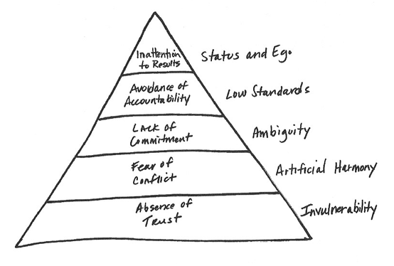

[The Five Dysfunctions of a Team](http://www.tablegroup.com/books/dysfunctions) (by Patrick Lencioni) is a highly recommended book for anyone that works with other people. (So - almost everyone!) The five dysfunctions are set up in a hierarchy. The bottom of the pyramid below shows that trust is the foundation and all else moves up from there.

The book opens with a story that brings the main five principles / dysfunctions to life. At first, the principles may seem like trite common sense, but after some exploration, you'll be able to see how time and time again teams fail because they haven't mastered these time-honored truths.

The wisdom in this book can be applied to any relationship: with yourself, significant other, family, etc. My purpose here is to demonstrate how the principles in this book apply to bands by sharing some of my experiences. (Later, I'll apply them to the teacher-student relationship in music education.)

## My Story

It all began in parents' basement. When I was 15 or so, my older brother and our mutual friend started a band. I joined shortly after. We covered the music of a couple of our heroes, really trying to channel them. We added some other members and decided to concentrate mostly on my original music. My brother left the band because he wasn't keeping up and we eventually kicked out the other original member because he wasn't cutting it. It was heartbreaking and dramatic for everyone involved to say the least.

I went on to study music at a conservatory. Many more bands came to life and died. The drama certainly persisted. After graduating, I became a freelance gigging guitarist. Given all my experiences in bands, I didn't want to be tied to any one particular band. Years later, I am happily committed to a couple of bands - Driven to Clarity and the No Land Band. Because we're all adults, these bands have been much more stable. After reading this book, though, I realized that these bands still have many foundational problems that are outlined in the Five Dysfunctions of a Team.

## Why Your Band Exists in the First Place

Rarely do band members decide what the band's direction is in the very beginning. It makes enough sense to feel out the situation and see if the band has potential. Confidence may grow as the band rehearses and improves, so their goals may change as this happens. The question is, do all the members think of the band the same way at any given time in a band's life? Broken hearts will be inevitable if one member sees the band as a somewhat-regular hangout with his buddies (with no intentions of ever performing) and another member sees the band as his ticket to rock-stardom. Most people don't fall squarely into one of these extremes, but more often than not, the members will lean towards different ends of the spectrum. This major issue brings us to the first dysfunction, lack of trust.

## Dysfunction 1: Lack of Trust

There will certainly be personality differences in any band. If everyone trusts each other, band members can openly discuss any issues without fear of penalty. The problem is, we bring a lot of assumptions to the table about our fellow members. Before it's even possible to resolve conflicts that may arise, we have to get better acquainted with the band members.

_Strengths assessment:_ Who in the band is musically educated? Who has valuable band experience? Who isn't afraid to be a leader?  
_Weakness assessment:_ Who in the band doesn't pick up things right away? Who doesn't have time to put in outside effort? Who resists certain musical styles, improvisation, original music, covers, etc?

If there's trust within a band, everyone will feel open to discussing everyone's strengths and weaknesses. There won't be criticism, only the improved understanding of how the band could be structured. Will one member take a leadership role? Or will each member be a "chair" of their own specific "department?" There are huge advantages to each situation. I'm in two bands that each do things differently. In the No Land Band, the lead singer is the band leader. He calls the tunes, he points to who will solo, and he gets most of our gigs. He's open to input from everyone, but it's not a democracy. This has been successful because we've created a reliable format that our fans enjoy and we don't need to satisfy all of our musical whims in this one band. Driven to Clarity is set up with 4 roles of equal importance. We all contribute to writing songs, getting gigs, and shaping how each song will go. The lead singer takes the president role when an executive decision must be made. This format has taken some time to evolve and we constantly tweak it.

_What builds trust in a band:_ Being professional, first and foremost. Be on time, in tune, and a pleasant person. Always be true to your word. Be vulnerable and say what's on your mind. [http://diymusician.cdbaby.com/musician-tips/the-10-commandments-of-being-in-a-band/](http://diymusician.cdbaby.com/musician-tips/the-10-commandments-of-being-in-a-band/)  
The ability to be vulnerable with your band members is the foundation of a band.

_What erodes trust in a band:_ Last minute rehearsal cancellations. Showing up more than 15 minutes late. Not learning or being willing to practice your parts to songs. Treating rehearsal like a drink-fest (if others think of it as disciplined work on a planned agenda). Perhaps the worst of all: insulting the character of fellow band members.

In the end, the music suffers when we don't trust our fellow band members; if we're suspicious that another member won't play the right parts or show up to a gig. If you're unable to work on these problems, the band's foundation crumbles.

## Dysfunction 2: Lack of Conflict

Many people hear the word 'conflict' and think there's something wrong. Lencioni thinks the _lack_ of conflict within teams is the problem! Conflict can be very healthy, provided that the members trust each other.

If healthy conflict is the goal, then why do people refrain from speaking their minds? Many times, it's good intentions - not wanting to hurt people's feelings. On the contrary, some people are unwilling to hear others' viewpoints.

Provided that band members trust each other, it's necessary for every member to be given the chance to argue and be heard. We don't need to win every argument. Just be heard.

_Some areas where most bands have disagreement:_

- Should we concentrate on original material or getting gigs where covers are the majority of the material?
- How should we record our music?
- Should we make a music video?
- Should we start a crowd funded venture?
- Should we have a band fund?
- How much money should we put in it?
- What should we spend our money on?

Some of these issues are minor. Some of them are major and heavily influence the direction of the band.

Some conflicts lead to unresolvable tensions. It's much better that these come to a head early on. I've been in too many situations where the band struggles for years, only to realize later that one member never enjoyed the music we were playing! This sort of thing is a waste of everyone's time. Being in a band is difficult enough, so get clear on what you want out of a band as early as possible. There's a band out there for you that can make that happen. Or, you can put together your own band after going solo for a while (if you have the means.)

## Dysfunction 3: Lack of Commitment

After band members argue their points, decisions must be made. One or more members may not be totally sold the decisions made. In fact, there may never be a consensus, but 100% agreement _isn't_ necessary. What is necessary is a "buy-in" to the decision that's made. If it's good for the band as a whole - all members should be on board. This is only possible if all opinions were heard and considered. Since the band is operating as a team, the members will acknowledge if they're not moving closer to their goals as time goes on. Any members that originally disagreed can make their points again without reservation because the band was able to see that it didn't work.

_Some reasons why members won't to commit to a band decision:_

- Resentment - not having your ideas heard may cause resentment.
- Ego - if you thought your personal ideas were superior or you have an inflated sense of your role in the band.

These sorts of things aren't insurmountable if we work on the next dysfunction.

## Dysfunction 4: Lack of Accountability.

After specific decisions are made, each member will have individual contributions that will be vital to achieving a band's goals. All members have to hold each other accountable. It's not just the job of the band leader, although he may be in charge of sparking discussions (depending on your band's structure). It takes an even more evolved form of professionalism to accept accountability and call out others when they aren't coming through.

_Examples:_

- When the bassist took over a month to get the files from the studio (which he volunteered to do), we had to call him out on it.
- When the drummer showed up 45 minutes late to the gig, we had to call him out on it.
- When the lead singer didn't work on the vocal phrasing, we had to call him out on it.
- When the lead guitarist had his amp turned up too loudly and his tone was nasty, we had to call him out on it.

No ultimatums are necessary. First, decide who will confront the offending member. Ask some questions: "What's the status of \_\_\_?" "Is there something the other members can do to help?" Remind the member about the importance of their task.

## Dysfunction 5: Lack of Results and Ego

_"There's no I in team!"_  
It's a cheesy saying, but it really comes down to achieving results as a band rather than stroking your ego. There's a difference between being stealing the spotlight and being inappropriate.

_Examples:_

- The drummer took an unrehearsed extended solo at the end of a love song. It wasn't a bad solo, but it was out of place.
- The lead guitarist dissed one of the other members while talking to a fan in the audience.
- The lead singer chose 3 songs (which he liked) that were inappropriate for the dance party we were playing.

Playing music with others is an experience without match. You can learn a lot by being in a band, even if the teamwork is sub-par. Most of us have dreams we long to achieve and we have to temper that with the good of the band. If you can keep your ego in check, it will lead to more satisfying musical experiences. Cheers to improving your relationships with your current and future band members. Happy playing!
