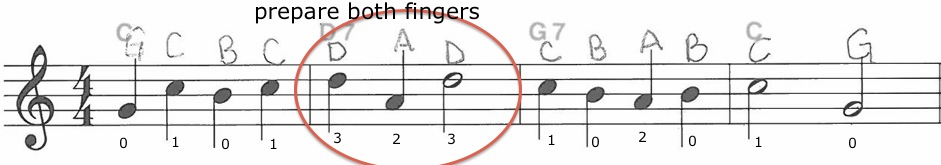
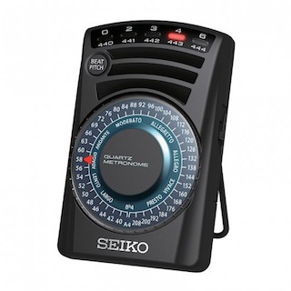

A long time student of mine recently began learning classical guitar. He had been studying jazz and blues for a number of years. He has a love for latin fingerstyle rhythms. The more lessons we had, the more he realized that he wanted to deepen his technical foundation. I recently told him:

> "The number of times you'll reach a plateau is inversely proportional to how deeply you practice."

In other words, steady progress comes with very slow practice and attention to very small details. In this article, we'll be going into how to deepen your practice and overcome your plateaus for good.

## Practice What Needs to Be Practiced

There's "playing" guitar and there's "practicing" guitar.

Playing is simply loving the experience of playing and living in the moment.

Practicing is finding the areas where you're weak and relentlessly focusing on them until you make improvements.

We need both the enjoyment, creativity, and musical satisfaction of playing the guitar and the discipline good practice habits to grow as a musician (and ultimately enjoy playing even more!)

The first error of practicing is playing what you're good at and hoping the spots that need work will get better on their own, without too much conscious effort. If you have a teacher, he or she will tell you what spots need to be practiced. If you're a good student, you'll work on those spots much more often than the other spots! (Have you been only playing the "fun" parts?) Don't have a teacher? Record yourself and diagnose your own playing. It won't be easy at first, but with time, you'll be able to zero-in on your problem areas.

## Write Your Music, Mark it, and Use a Practice Log

It's helpful to have a printed piece of sheet music in front of you while practicing. If you don't, it will benefit you in many ways to write it down in TAB, chord sheet, or standard notation. Begin marking the music by identifying the overall structure of the piece and phrases that are found in multiple places. Then, circle the areas that give you difficulty. You'll then be marking the music with technique reminders, including:

- circled notes
- left and right hand fingerings
- picking directions
- string numbers
- note letter names
- TAB
- and anything else on the page that will assist with technique.

In addition to marking the music directly, you should also write down what you've been working on in a practice log (journal). Here's the suggested format with an example:

- WHAT: Measure 3, beats 2-4.
- TEMPO: 60 bpm (Goal tempo: 90 bpm) [Note: bpm stands for "Beats Per Minute"]
- NOTES: I'm struggling with getting my pick to move in a relaxed way from the first string to the third string.

## Windows of Focus: Finding Problem Areas

For example, let's say your music is 4 measures long. You can play measures 1 and 2 easily. You begin to stumble on measures 3 and 4\. You'll then focus on measure 3 by itself. Then, focus on measure 4 by itself. Then, put both measures together. Finally, make sure you can smoothly connect measure 2 to measure 3\. Oftentimes, to master measure 3, you have to focus on part of the measure, rather than the full measure. You might stumble on beats 3 and 4 of measure 3, so focus on just those two beats. The shorter the musical passage you're focusing on, the more "closed" your practice "window" is.

## Metronome Workout: Working on Problem Areas

Let's go back to our theoretical 4 measure piece of music. How fast can you play measures 1 and 2 cleanly? The only way to know for sure is to use a [metronome](https://www.onlinemetronome.app). The metronome is how we turn practicing into a rigorous scientific procedure. Think of it like exercise. Would you work out without keeping track of the weight you can lift? Would you always lift the same 50 lb. weight and never get stronger? Or, worse yet, would you risk injuring yourself by setting the exercise machine to 50 pounds one day, then 80 the next day? You always want to be moving in gradual succession, increasing the weight little by little during your regular lifting sessions. My favorite ways to use a metronome are below:

1. Find the "goal tempo." What is the actual tempo of the piece of music you're trying to master? Write this down in your practice log.
2. Find your "working tempo." Set the metronome at a medium tempo and adjust it until you find a tempo that you can play some of the piece comfortably. Note this in your practice log (along with anything else you noticed while playing.)
3. Find your "bottom tempo." When learning something new, play slowly at first. "You have to walk before you can run." It's close to impossible to play something at the proper speed without being able to play it much slower. Metronomes usually go down to 40 bpm (and no less.) This is incredibly slow. I usually work with faster bpm and allowing the metronome to click as 8th notes or 16th notes. Here's an example: I'd like to practice measure 1 at a very slow tempo, say 30 bpm. Set the metronome to be 60 bpm and hear 2 clicks as equal to one quarter note; this means that each click is one 8th note. That still seems a bit slow, so you could set the metronome to be 120 bpm and hear 4 clicks as equal to one quarter note; this means that each click is one 16th note.
4. Find your "top tempo." If there's a passage you can play comfortably, find the fastest tempo you can play that passage. What in your body started tensing up? Are you noticing any pain or other discomforts? Note the tempo and your observations in your practice log.

## Fixing Problem Areas For Good

1. "No-Rhythm Practice" - Turn off the metronome. Play the piece at your desired piece, turning every note into a longer rhythm (half or whole notes.) Now, turn on the metronome at 40 bpm. You'll be playing a single note on the first click. You'll check your left hand on the second click. You'll check your right hand on the third click. You'll prepare the next note on the fourth click. There's a lot to check, right?
2. Speak (or sing) the music - After noting what needs to be worked on, it's time to add your voice to the mix. Simply speak out loud the left hand fingering, right hand fingerings, string numbers, note letter names, or TAB. This can be done while playing the guitar with the left or right hand only. It's very beneficial to sing a passage even if you don't have a great voice!
3. Isolate your hands or fingers - Many players focus solely on their left hand, but a great many problems actually originate in the right hand! If you're in the habit of playing a passage with just your left hand for a while (just lightly touch the frets needed without making a sound), or picking the strings that would be played (open, instead of fretted), then you'll synchronize much faster when you put your hands together again. The same goes for your fingers. Just practice the parts that involve your index, middle, ring, or little finger. This is especially helpful when practicing chord changes.
4. Design an exercise for the problem passage - Having a problem trilling between your ring and little fingers? Try that trill on every string. Try it as a scale passage.
5. Be mindful of transitions - The couple of notes between two phrases or sections of music are often neglected because they might not make immediate musical sense when practicing them in isolation. Because they often don't sound "right," many players gloss over transitions and the piece suffers because of this. Transitions are also difficult because there can be completely different musical ideas between the two sections, and these will necessitate different techniques. One must pay special attention when switching techniques.
6. Play it perfectly 8 times in a row - Many times students are content with "making it through" a passage one time. A lot of times it can be attributed to luck and the student won't be able to do it again, especially in a more strenuous situation, like the guitar lesson or performance. Great players are absolutely sure they can play a passage and the only way to know is through repetition.
7. Keep economy of motion in mind - Prepare other fingers before they're needed. Where's it coming from, where's it going?
8. Set up your practice station for success - Make it easier to practice by having a dedicated area for it that's always set up. Have a music stand, pencil, practice log, metronome, and computer close by. Use backing tracks as necessary.
9. Eliminate excess tension / know your physiology - When we use our bodies inefficiently, tightness and strain occurs. Efficiency is gained through a two-fold knowledge of precisely how the body moves (anatomical motion) and the instrument itself. Knowing how to detect and alleviate tension is crucial.

- Breathe with the passage: once every 1/2, 1, 2, 3, or 4 measures
- Hand exercises and proper warmups
- Diet - enough sodium, carbs, protein, leafy greens  
  _Personal note_: It's interesting how much what you eat can affect you. I have [gluten sensitivity](https://celiac.org/celiac-disease/non-celiac-gluten-sensitivity/) which caused me many playing problems: Tendonitis, joint pain, circulation issues, among other things. These are all 90-100% eliminated since cutting gluten out of my diet.

10. Respect the amount of time it takes - I realized while visiting Spain one summer that my 5 years off-and-on of reading Spanish and hearing once in a while really wasn't enough to hold a more than kindergarten level conversation with someone who knew the language. I felt like I knew nothing, and there were so many words, contexts, and conjugations that it felt like it would take "forever" to learn to speak Spanish. I really felt empathetic with my music students! Some things I mention to my eager guitar students: With absolutely proper instruction, someone with normal talent can strum through some songs, play some riffs, and read music in the first position in the first year of instruction. Maybe he could even go to a jam session. The problem is, to feel like a "native speaker" of guitar, you'll need at least 5 years of training to have performance-worthy technique. "Total immersion" is necessary throughout those 5 years in order to follow what you hear others play, or realize ideas that you hear in your head.

11. Question and re-evaluate - How do you feel about what you've played? What are you interested in learning at this point? How do you feel about learning a new style? Have you ever thought about composition, another instrument, another aspect of music, or a non-music topic?  
    It's possible that you might not be ready to master something and you'll need to put a piece or technique on the shelf for a later time. Music is cumulative - if you didn't get it perfect the first time around, you'll surely encounter it again if you keep playing.  
    How is your practice method working for you? Are you putting in enough practice time?

## Practice Quotes - Motivation for Students of Music

> "Amateurs practice until they get it right, but that professionals practice until they can't get it wrong."

_Dr. Sam Hamilton, USMC excerpt from The Inner Art of Airmanship_

Once you can play a passage without mistakes, you should repeat it eight times or more to solidify your progress. If you get it right once or twice, it could be mostly luck. Play it eight times correctly, then revisit it later in the day. Then visit it tomorrow to reinforce it. Repeat!

> 'If you don't practice one day, you'll know it. If you don't practice for two days, your friends and fellow musicians will know it. If you don't practice for three days, everyone in your audience knows it!'"

_George Van Eps_

Can you imagine a professional musician getting on stage and saying "I haven't touched this thing in a week...I just haven't had time." You'd probably be pretty horrified! Music is his job, and his life. Many of us have a creative "muse" but maybe more of us should develop a "practice muse" that never settles for less than perfection.

> "It is a paradoxical but profoundly true and important principle of life that the most likely way to reach a goal is to be aiming not at that goal itself but at some more ambitious goal beyond it."

_Arnold Toynbee_

Practice until you get it right...and then some. Play the piece faster than you would need to. Figure out music that you want to play, but don't think you can. Always challenge yourself.

## More Reading and Inspiration

- [Jamie Andreas at guitarprinciples.com](http://www.guitarprinciples.com/the-basic/the-principles) - Read all that Jamie has to say. Jamie was one of the first people to inspire me to practice better.
- [The Bulletproof Musician](http://www.bulletproofmusician.com/blog/) - This has been a great blog for a long time.
- [Craig Sparks on Practicing](https://allthecatsjoinin.wordpress.com/2012/11/29/intentional-practice/) - Fellow teacher and musician has these great words to share.
