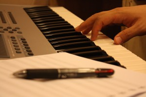
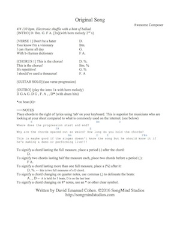
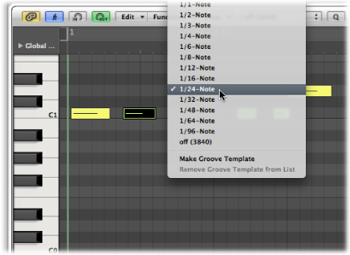
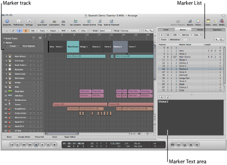
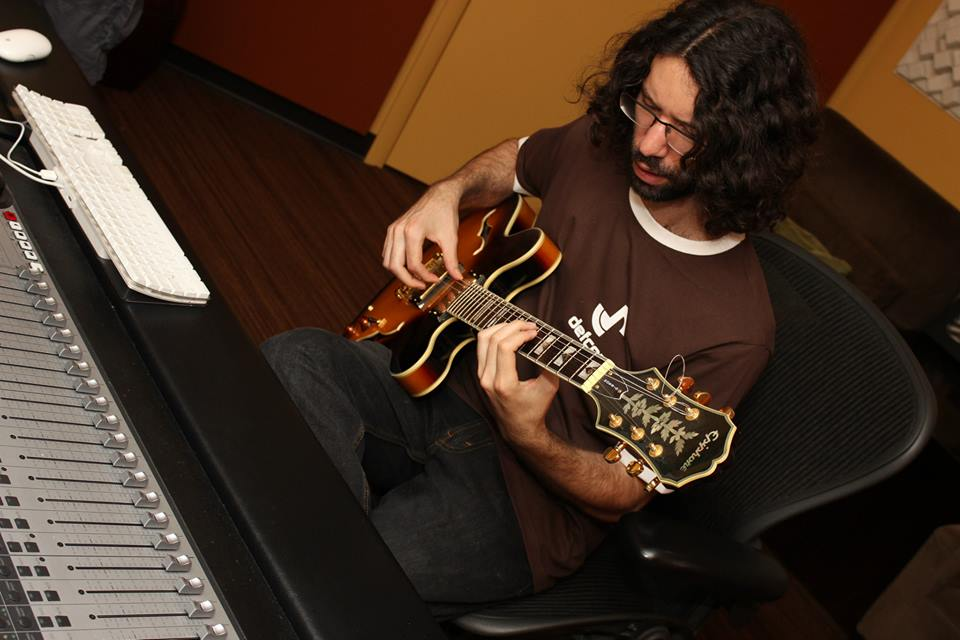

We songwriters put a lot of work into our songs.

Putting together interesting chord voicings, refining our lyrics to perfection, and getting the form 'just right' can take a lot of effort, but be very gratifying. When your song is finally finished, you might want to make the investment of bringing it to a studio with a band to lay down all of the parts.

When it comes to recording in the studio, you can't be too prepared! To get the most out of your recording sessions, it's best to work out even more details than you may have when working out the song from a songwriting perspective. Here is what I do with almost every song I plan on recording for my albums. If you're not a studio pro, then all of these steps will be absolutely vital to having a recording session flow smoothly.

## 1\. Make the First Pre-Demo

You've practiced all the parts to perfection, right? Now, perform the song while recording. It's advised to make this pre-demo, not studio, quality. I use [Audacity](http://www.audacityteam.org/) for one-off recordings and export them as MP3s.

## 2. Evaluate the First Pre-Demo Recording

Have a careful listen of your recording. Did you include: Every measure of the song? An intro? An outro? Every transition?

## 3\. Record and Edit into Pre-Demo 1

Record the sections which may not have come out right. Make sure the form and structure are perfect. You can simply overdub sections and edit these into your original recording.

## 4\. Record a Second Pre-Demo for Comparison

Re-record your song in its entirety. Compare to your edited original recording to make sure you're being consistent. Remember, you're committing to every note of the song before you go into the studio. You might want to repeat parts 1-4 until you're happy with the pre-demo.

## 5\. Make a Lyric & Chord Sheet

As opposed to a lead sheet, which has written melody notes, the lyric & chord sheet contains the vitals without having to notate your music. (The musicians you are recording with should be able to pick up the song by ear. If your song is very complex and requires manuscript notation, by all means, provide it for the musicians.) I recommend including notes on instrumental sections and any other text that could help convey how the song should go. Click the image below to see an example lyric/chord sheet (PDF):

The bottom of the pdf shows what **not** to do - i.e. what's commonly found on the internet.

Why bother making this sheet? For one, writing down your music will further solidify your demo. You'll also want to have this for reference while tracking and editing.

## 6\. Identify the Tempo and Time Signature

As you listen to your pre-demo, tap the tempo into a tap-tempo tool. ([Here's one](http://www.all8.com/tools/bpm.htm) I recommend).

Most musicians (even professionals) perform with tempo fluctuations, so you'll have to decide what the tempo is. If the performance is rushing in spots, choose the slower end of the tempo spectrum. If the performance is dragging in spots, choose the faster end of the tempo spectrum. Identify the [time signature.](http://www.dummies.com/how-to/content/common-music-time-signatures0.html)

## 7\. Use a DAW for the Working Demo

- Set up a new project in Logic (or other DAW). Set the project's time signature and tempo (from step 6).
- Make a click track in its own separate track. You can make one using the Klopfgeist plugin or using some high percussion sounds in the kit in the EXS24 plugin. [https://ask.audio/articles/building-custom-click-tracks-in-logic-pro-x](https://ask.audio/articles/building-custom-click-tracks-in-logic-pro-x)
- Create a basic drum beat using MIDI samples triggered by the EXS24 or Ultrabeat. Use 8th notes (and sometimes 16th notes) for better timing purposes. I recommend quantizing all of your MIDI parts and not adding a humanizing function. We'll leave that up to your performers!
- Delineate the sessions with markers and/or clearly delineate your MIDI regions.
- Add basic MIDI piano for rhythm backing. Don't forget to quantize it.
- Add any distinctive lead melodies in MIDI with an organ or other instrument. Also, quantize it.
- Record a scratch vocal. It doesn't have to be perfect, but it will be used in the recording session. So, make it a decent take.

Wondering why we're using MIDI to create synthesized parts? I can't count how many times I've wanted to change something while working in this part of the demo phase. I find it far easier to play in a draft using my MIDI controller and edit in the piano roll, rather than picking up a guitar and recording it. You can very easily change the key of a section in MIDI (I would use the piano roll, not the 'transpose' option on the region.) Finally, MIDI takes up very little hard drive space. You won't have to clean up the project folder later for parts you won't use.

## 8\. Create an Instruction Sheet

Include your stylistic influences and direction on how a performer should interpret the demo. It's going to be inevitable that your performers will ask "how do you want me to play this part" or "what do you want me to do here?" This sheet should be made in anticipation of these types of questions.

## 9\. Polish and Send

Now you finally have a demo with synthesized parts and your scratch vocal. Send your demo, session files, lead sheet, and instruction sheets to your performers and producers. Print multiple copies of the sheets for the session. (Recommended: Copyright your music.)

## A Final Note

This may seem overly exacting and tedious. Some songwriters might hope that the "magic" will happen with the right producer and the right take. In my experience, sometimes the "magic" doesn't happen and I have to go home and prepare what I'll play in the next session anyways. There's no substitute for the confidence gained from recording experience. Be prepared for your sessions and it will free you to make REAL magic!

We hope this helps! Leave a comment to let us know how you prepare your demos for recording sessions.
