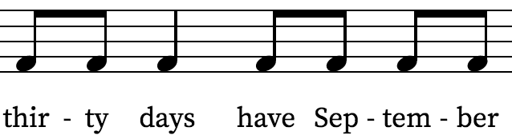
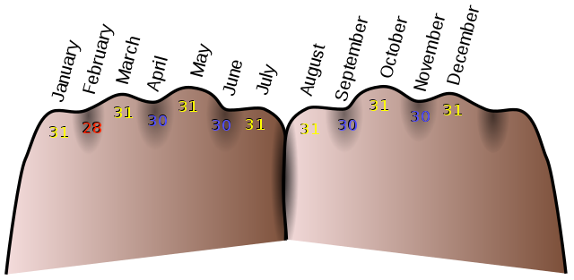
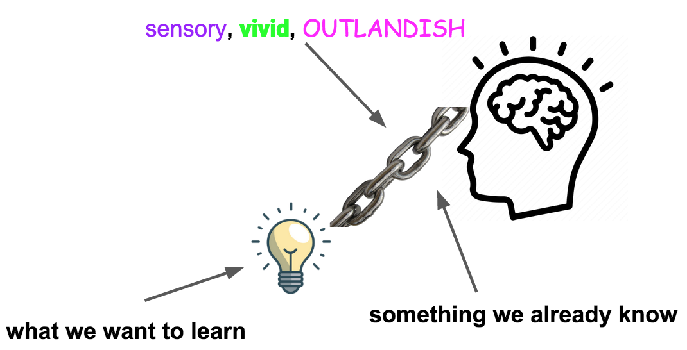
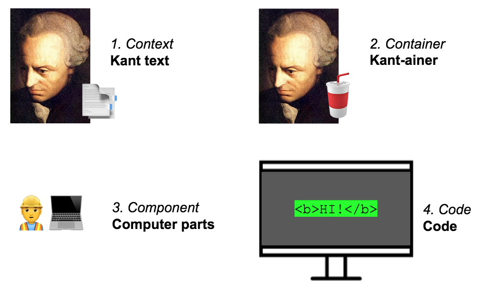
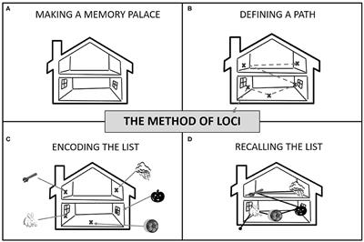
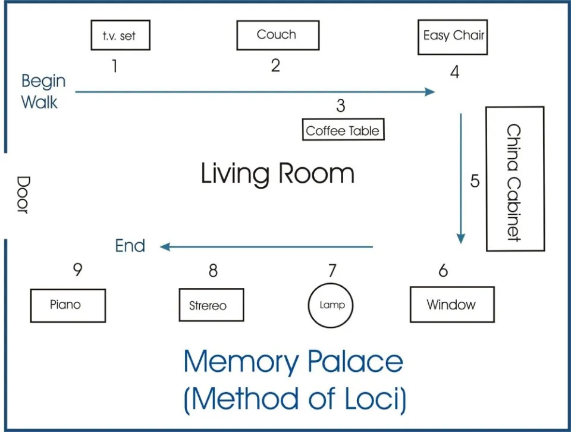
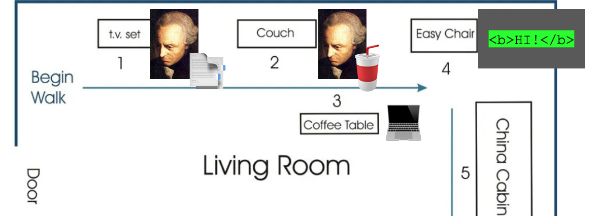

Below is the blog version of a talk I gave on memorization techniques.

Other formats:

- [See the talk on YouTube](https://youtu.be/jlI2ED8pWI4)
- [PDF](/Multimodal-Learning-scraggo-com.pdf)
- [Powerpoint](/Multimodal-Learning-scraggo-com.pptx)

**Contents**

- [Why this talk?](#why-this-talk)
- [What we'll explore](#what-well-explore)
- [My story - hitting a wall of text](#my-story---hitting-a-wall-of-text)
- [Rote learning takes up to 160 repetitions](#rote-learning-takes-up-to-160-repetitions)
- [A new approach - drawing pictures](#a-new-approach---drawing-pictures)
- [The Art of Memory](#the-art-of-memory)
- [Why text is the default](#why-text-is-the-default)
- [Imaginative powers - senses, faces, time, spaces](#imaginative-powers---senses-faces-time-spaces)
- [Mnemonics](#mnemonics)
- [Elaborative Encoding](#elaborative-encoding)
- [Elaborative Encoding Example - Remembering the C4 model](#elaborative-encoding-example---remembering-the-c4-model)
- [Method of Loci - Walking through a memory palace](#method-of-loci---walking-through-a-memory-palace)
- [Method of Loci Example - Putting the C4 model in a memory palace](#method-of-loci-example---putting-the-c4-model-in-a-memory-palace)
- [Choosing memory palaces](#choosing-memory-palaces)
- [Final thoughts](#final-thoughts)
- [Resources](#resources)

## Why this talk?

The goal of this talk is to introduce some learning and memory techniques. I'm hoping that you'll find them fun and interesting and you'll want to try them out.

_Question: what should people learn in an age of chatgpt?_

Learning, in general, has always been fascinating to me. These days, I've had to ask myself what we still need to learn and actually remember. When I chatted with AI about it, the bots reminded me that curiosity and creativity (which are both supported by learning and memorization) are more relevant than ever.

## What we'll explore

- The state of learning today, how we got stuck on a narrow way of learning (text)
- How multimodal memory techniques can broaden how we learn; make it more fun and efficient

## My story - hitting a wall of text

[How I'm Building My Second Brain](/building-my-second-brain/)

A while back, I discovered the "second brain" methodology of note-taking. The goal of a "second brain" is to create a digital network of knowledge - and that's done by connecting notes. The more notes you create and link together (using "backlinks"), the more your network of nodes expands and frankly, the results just look really cool.
So, I did just that - I made summaries of books, articles, and podcasts. I was proud of my ability to be a human summarizer.

```
// big .md notes collection

Projects
[[how-to-x]]
[[how-to-y]]

x
[[all-about-x1]]
[[all-about-x2]]
```

I read and re-read my hand-crafted notes but didn't notice myself being able to recall things (that well or at all) given how much time I spent. You could say I hit a wall - _a wall of text_. I wasn't even close to being a kickass walking encyclopedia.

## Rote learning takes up to 160 repetitions

~[Rote Memorization and Alternatives to Learn Faster and More - A Tutor](https://atutor.ca/rote-memorization/)

Looking back, by reading, and re-reading my notes, I was essentially trying to learn by rote.

Our brains reserve resources for interesting events, they're primarily concerned with survival. Just exposure to abstract concepts (in text form especially) isn't nearly interesting enough to take up precious mental space.

So, clearly, that wasn't working.

## A new approach - drawing pictures

I started drawing pictures of concepts I was trying to learn.

As we all know, a picture is worth a thousand words, and I was able to remember things a lot better.

I also remembered that [50% of our brains are involved in visual processing](https://www.imagethink.net/true-or-false-vision-rules-the-brain/).

Thinking visually results in a significant gain in brain capacity utilization!

## The Art of Memory

As I dug further, I uncovered memory techniques that were used by the ancient greeks and romans. They were able to remember impressive amounts of information. They gave speeches from memory, engaged in lively debate, and demonstrated the potential of human memory. Books weren't prevalent, so the main place human knowledge was stored was in people's heads.

See [Ars Memoriae](https://en.wikipedia.org/wiki/Art_of_memory) - 2500 year old memory techniques

## Why text is the default

Text is the dominant form of communication. It's convenient and storage-friendly. Conversations start in Slack or email and then make things official with (Google Docs, and other text collaboration platforms).

Another example is a conversation with ChatGPT. Text goes in as a question and we get an answer in text.

But what about the in-between bits - the thought processes behind coming up with the question and how we process the answer?

I see text as the end result. But it's a handicap to think only in text - _thinking benefits from going beyond text_.

## Imaginative powers - senses, faces, time, spaces

So, let's lay the groundwork for enhancing our memories and learning better as a result.

Senses:

- We'll first get in touch with our imaginative powers. By that, I mean conjuring something in the mind, usually associated with one of the 5 senses. Associating what we're trying to learn with one or more of the senses helps create a richer, more vivid learning experience.

Faces:

- A significant part of the visual part of our brains can remember faces in great detail, so faces can be great learning aids.

Time:

- We also tend to remember momentous times in our lives. (In the talk is a picture of my nephew who was born in 2005.)

Spaces (the birth of the memory palace technique)

- Another "sense" (as it were) is spatial memory - our brains are evolved to remember locations of important resources. A Greek poet in the 6th century BC used this fact to his advantage. He was having dinner with colleagues, left the building, and the next thing he knew, the building collapsed, killing everyone inside. He noticed that he was able to recall each person's locations in the dining hall without having made an effort to do so. (This is the origin story of the Method of Loci, which I'll talk about in a bit.)

## Mnemonics

Let's see some memory techniques which use our imaginative powers. Mnemonics, which you're probably familiar with, are any conceptual device that helps us remember something.

The way I learned to remember which months have 30 days is through song and utilizes our auditory imagination.



That stuck with me really well but we can condense it into an _acronym_ - SANJ (as long as you differentiate between June and the other J months.) This adds a sense of taste to the mnemonic.


There's also a visual and tactile mnemonic to remember that - using your knuckles and the spaces between them to represent the months.



_[Image credit: Mnemonic - Wikipedia](https://en.wikipedia.org/wiki/Mnemonic)_

These mnemonics engage our senses which makes it easier to remember what we're trying to remember.

## Elaborative Encoding

The next technique, Elaborative Encoding, uses mnemonics.

By elaborating new information with what's already-established, it becomes easier to learn and recall this new information.



We're linking the _new_ to the _old_:

- the link should be conceptually related to the new
- the link should be something we already know and can recall easily
- the more sensory, vivid, wild, outlandish the link is, the more effective it will be

This augmenting process makes it something our brain will be much more likely to pay attention to.

Let's see an example.

## Elaborative Encoding Example - Remembering the C4 model

> The C4 model is an easy to learn, developer friendly approach to software architecture diagramming. ... It's a way to create maps of your code, at various levels of detail, in the same way you would use something like Google Maps to zoom in and out of an area you are interested in.

~[C4 model](https://c4model.com)

I was looking for a way to remember the four similar sounding C words of the C4 model.

1. Context
2. Container
3. Component
4. Code



Using visual, sound, taste, and other associations, each word is elaborated to help encode it into my memory.

1. Context - sounds like "Kant-text"
2. Container - uses "Kant" and him drinking out of a container
3. Component - sounds like "Computer" and I think of its constituent parts
4. Code - code on a screen (no need to over-complicate it)

## Method of Loci - Walking through a memory palace

One of the ancient memory techniques used by memory experts today the _Method of Loci_ - Walking through a _memory palace_.

> The method of loci is a strategy for memory enhancement, which uses visualizations of familiar spatial environments in order to enhance the recall of information.

~[Wikipedia](https://en.wikipedia.org/wiki/Method_of_loci)



_Image credit: https://www.monitask.com/en/blog/best-memorization-techniques_



_Image credit: https://themdjourney.com/studying-with-memory-palace-in-medical-school/_

## Method of Loci Example - Putting the C4 model in a memory palace

As I mentally travel through the room, I note each _point of interest_ in the numbered order.



1. Context - The first point is the TV - there's a documentary playing on it about how Kant wrote his most influential works.
2. Container - Kant is resting on the couch drinking a milkshake.
3. Computer - Kant was fascinated by the computer on the dining table and he took it apart.
4. Code - On the easy chair is a monitor with code displayed on it.

## Choosing memory palaces

Places you're very familiar with:

- Childhood home(s)

Places you associate with learning:

- School
- Coding bootcamp

Etc:

- Street routes
- Famous places
- Fictitious places
- any place with interesting spatial qualities that can be easily recalled

## Final thoughts

Learning this way is fun, engaging, and motivating. It's personalized and creative, not just text on a page or screen.

(These techniques would've been _extremely_ helpful when I was in school.)

I think you'll learn more faster by drawing, generating mnemonics, and using a memory palace:

- you'll use more of your brain (>50%)
- less time re-reading (160x faster)
- 1 picture, 1000 words (1000x more efficient)

## Resources

I highly recommend checking out [Moonwalking with Einstein: The Art and Science of Remembering Everything by Joshua Foer](https://www.amazon.com/Moonwalking-Einstein-Science-Remembering-Everything/dp/0143120530). It goes into great depth on how to become a memory expert.

Memorization / Learning

- [WorkLife with Adam Grant: How to remember anything | TED Talk](https://www.ted.com/talks/worklife_with_adam_grant_how_to_remember_anything?referrer=playlist-worklife_with_adam_grant_mar_2019)
- [How to Build a Memory Palace | Art of Memory](https://artofmemory.com/blog/how-to-build-a-memory-palace/)
- [Mnemonic - Wikipedia](https://en.wikipedia.org/wiki/Mnemonic)
- [Elaborative Encoding - Wikipedia](https://en.wikipedia.org/wiki/Elaborative_encoding)
- [Method of Loci - Wikipedia](https://en.wikipedia.org/wiki/Method_of_loci)
- [Studying with a Memory Palace in Medical School - TheMDJourney](https://themdjourney.com/studying-with-memory-palace-in-medical-school/)
- [Best Memorization Techniques For Professionals: Better Memory](https://www.monitask.com/en/blog/best-memorization-techniques)

Integration

- [Integrating Sweep Picking With Other Techniques | Wizard of Shred](https://www.thewizardofshred.com/index/integrating-sweep-picking-with-other-techniques)
- [https://en.wikipedia.org/wiki/Meaningful_learning](https://en.wikipedia.org/wiki/Meaningful_learning)
- [https://en.wikipedia.org/wiki/Integrative_learning](https://en.wikipedia.org/wiki/Integrative_learning)
- [https://en.wikipedia.org/wiki/Interdisciplinarity](https://en.wikipedia.org/wiki/Interdisciplinarity)
- [https://en.wikipedia.org/wiki/Deeper_learning](https://en.wikipedia.org/wiki/Deeper_learning)

Visualization

- [What is Visual Learning? | Presentation Guru](https://www.presentation-guru.com/what-is-visual-learning/)
- [15 Visualization Techniques To Help You Achieve Your Goals | Indeed.com](https://www.indeed.com/career-advice/career-development/visualization-techniques)
- [3 Effective Visualization Techniques to Change Your Life | Psychology Today](https://www.psychologytoday.com/us/blog/living-forward/201806/3-effective-visualization-techniques-change-your-life)
- [Huberman Lab, Science-Based Mental Training & Visualization for Improved Learning](https://hubermanlab.com/science-based-mental-training-and-visualization-for-improved-learning/) (Podcast)

Comprehension

- [Toastmasters, Aristotle, and the Essential Art of Rhetoric | The Art of Manliness](https://www.artofmanliness.com/career-wealth/career/podcast-890-toastmasters-aristotle-and-the-essential-art-of-rhetoric/)) (Podcast)
- [The Art of Manliness, Beyond Lazy Learning — The Keys to Gaining and Retaining Knowledge](https://www.artofmanliness.com/career-wealth/career/podcast-927-beyond-lazy-learning-the-keys-to-gaining-and-retaining-knowledge/) (Podcast)

Motivation

- [Pleasure of learning | supermemo.guru](https://supermemo.guru/wiki/Pleasure_of_learning)
- [Book Summary: Drive by Daniel H. Pink | Sam Thomas Davies](https://www.samuelthomasdavies.com/book-summaries/business/drive/)
- [The Pathless Path (Paul Millerd) - Summary, Notes & Review - Aseem Thakar](https://aseemthakar.com/the-pathless-path-paul-millerd-book-summary-notes-review/)

Other

- [The C4 model for visualising software architecture](https://c4model.com/)
- [Guitar Chord Finder | oolimo.com](https://www.oolimo.com/en/guitar-chords/find)
- [Essentialism by Greg McKeown - Summary & Notes](https://www.grahammann.net/book-notes/essentialism-the-disciplined-pursuit-of-less-greg-mckeown)
- [Steven L. Franconeri - Faculty - Kellogg School of Management](https://www.kellogg.northwestern.edu/faculty/directory/franconeri_steven.aspx) - Courses - Visualization for Persuasion
