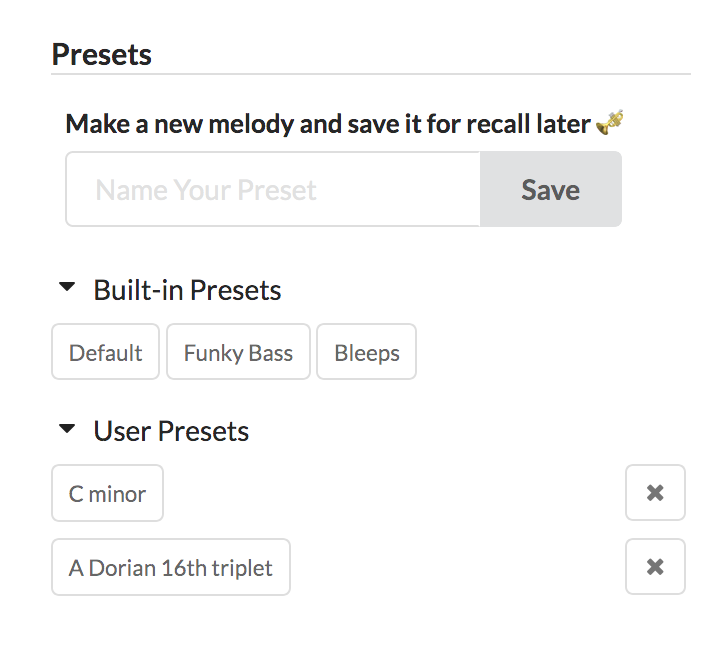
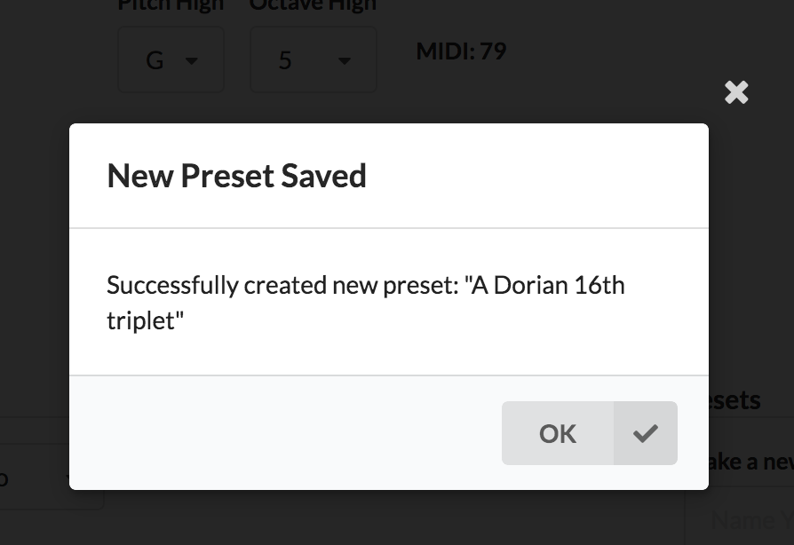

## New in 1.1.0

Yesterday, I released a feature that's been in the works for over 6 months. You can now create melody presets. [Check it out!](https://random-music-generators.onrender.com/melody)

If you have a go-to set of form parameters that make sounds that you really enjoy, you can save them and recall them later.

As a necessity of saving presets, I added the ability to create an account. This will set the stage for being able to save presets for rhythm, chord progressions, and anything else added in the future.

Given how new accounts are, expect there to be some related niceties added and bug fixes in the near future.

## Got a preset you want to share?

If you have a cool preset you want to share, send me a screenshot and I can add it to the defaults that anyone can use!

## Stats

- Over 7,800 people have used the app since September 2019
- The app was first deployed in March 2018

## Check it out and suggest features!

[Random Music Generators](https://random-music-generators.onrender.com/)
