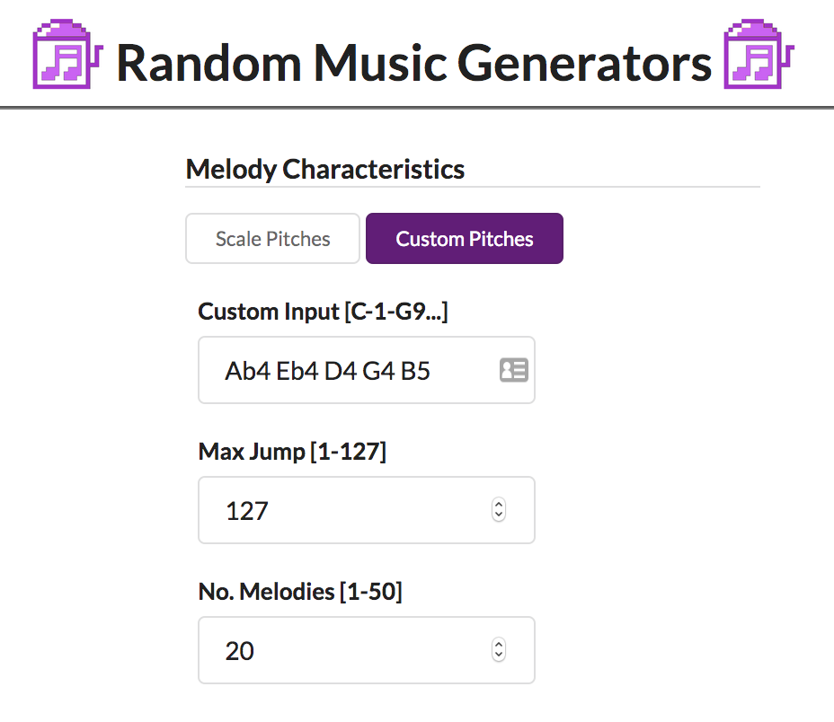
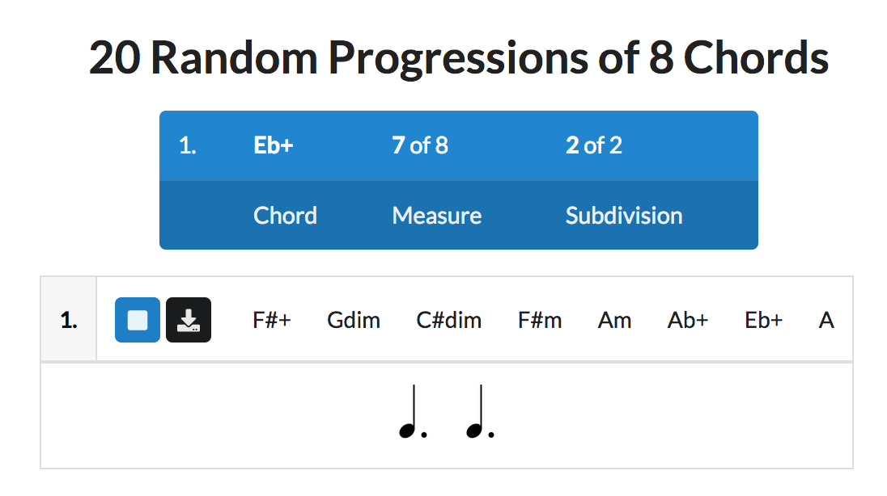

## New in 1.3.1

This month, I released a big new feature that's been requested often. You can now _specify a custom note collection_ to create random melodies. [Check it out!](https://random-music-generators.onrender.com/melody)

Note: This feature is available to use if you create an account.

Part of the impetus to provide this feature was to aid in neuroscience research. Having the ability to create melodies with specific pitches will allow researchers to study `tonal memory` (working auditory memory for pitches) and how many notes of a specific type will saturate it. How cool is that?!

I also updated the display of the chord progression playback so it's easier to tell where you are in the progression:

In addition to these new features, there were a couple of bug fixes:

- In the Melody > Varied Rhythm section, if you entered No. Measures more than 1, it was just repeating the first measure.
- Melody Presets were failing to load

## Stats

- Over 101,000 people have used the app since September 2019

## Check it out!

[Random Music Generators](https://random-music-generators.onrender.com/)

## Suggest features

[Contact me](/contact)
