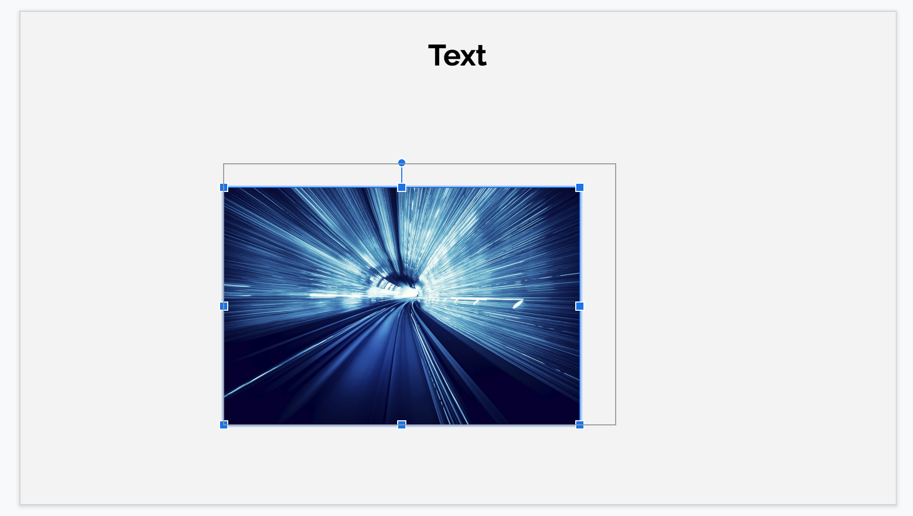

The many advantages of combining design patterns

You might be familiar with the 23 "Gang of Four Design Patterns".

> [read about them here](https://www.journaldev.com/31902/gangs-of-four-gof-design-patterns)

Learning them is no small feat. Luckily, my mentor pointed me to a fantastic online resource, [Refactoring Guru](https://refactoring.guru/). Each of the classic patterns is described and explained with illustrative examples in multiple languages. The process of learning them has given me the opportunity to work on classic object-oriented programming (OOP) with TypeScript - something I've wanted to do for a long time.

> [Refactoring Guru - an excellent resource I'll be referring to throughout the article](https://refactoring.guru/)

Another suggestion from my mentor was to _combine_ design patterns. I've been systematically combining patterns and simultaneously thinking of applications for them. Having gone through this process, I can say that I'm much more confident about this topic as a whole.

## Why combine patterns?

1. You're forced to understand how the patterns work on their own, before combining.
2. You strengthen your understanding of the vocabulary/terminology used for each pattern.
3. You begin to gain intuition about appropriate applications for the patterns.

## Why combine the Flyweight and Memento patterns?

Common problems we face in designing applications include state management and performance.

I created minimal a slides presentation app where both of these concerns need to be addressed.



- We use the **Flyweight pattern** to address the performance aspect by creating a shared repository for large objects - images in this case.
- We use the **Memento pattern** to handle state management - we want to have a command history with the ability to save and restore a snapshot of the state at any given moment.

Disclaimers:

- This app doesn't have a user interface - I've only included _models_ containing the underlying logic for the user interface that could be implemented later.
- Details that don't illustrate the core points of combining these two design patterns aren't included.

## How do the patterns work separately?

Every design pattern is a tool-kit that affords the developer certain advantages. I think of these advantages as "affordances" (as discussed in the book [The Design of Everyday Things](https://en.wikipedia.org/wiki/The_Design_of_Everyday_Things)). The process of creating an outline for each pattern with these points has proven fruitful for me:

- Common Problem Scenario
- Terminology
  - Transformation
- Change Dimensions
- Scalability
- Couplings
- Communication
  - Access Control
  - Encapsulation
- Performance
- Similarities

### How the Flyweight pattern works

The [Flyweight pattern](https://refactoring.guru/design-patterns/flyweight) greatly reduces RAM usage for objects that are used repeatedly throughout an application. Each object usage has a _shared_ (intrinsic) state and (optionally) a _unique_ (extrinsic) state. The flyweight intelligently caches the shared state and allows operations that involve both the unique and shared states of an object.

I very much encourage you to read through [Flyweight pattern | Refactoring Guru](https://refactoring.guru/design-patterns/flyweight). It contains a lot more information, including the UML diagram.

Here's my summary of the pattern's affordances, properties, and methods:

- Common Problem Scenario - Your app needs to create lots of unique objects that share some common elements. Your program crashes because these objects are taking up a lot of memory.
- Terminology
  - `A` - "Flyweight". `A.sharedState`. `A.operation(uniqueState)`
  - `B` - "Context". Holds uniqueState and a flyweight initialized via constructor. `B.operation` calls `A.operation`.
  - `C` - "Factory" - handles the caching and retrieval of `A`.
- Change Dimensions / Scalability - We can add as many `A`s as RAM allows. This allows us to scale upwards and add as many `B`s as we’d like.
- Couplings - `B` must contain `A`, they are necessarily linked.
- Communication - The client only interacts with `B` by calling `B`’s constructor with desired properties. `B` calls `C` to get an `A`.
  - Access Control / Encapsulation - `A` can’t be mutated, while `B`’s unique state can be
- Performance - We take advantage of caching and using objects by reference instead of value
- Similarities to other patterns - see [Flyweight pattern](https://refactoring.guru/design-patterns/flyweight)

### How the Memento pattern works

"The [Memento pattern](https://refactoring.guru/design-patterns/memento) is a behavioral design pattern that lets you save and restore the previous state of an object without revealing the details of its implementation." [source](https://refactoring.guru/design-patterns/memento)

Here's my summary:

- Common Problem Scenario - You’d like to add an undo/redo stack to your application. The objects you want to save have private state fields, yet you need access to them.
- Terminology -
  - `A` - "Originator" object that holds state. `A.state`, `A.save()`, `A.restore()`
  - `B` - "Memento" object that contains `A`’s state and grants privileged access only to `A`. `B.state` (contains `A.state`), `B.getState()` -> a public getter for a selected state property
  - `C` - "Caretaker" class that uses `B`’s limited interface to create a stack/history. `C.history` is a stack of `B`s. Contains `A`. `C.undo` -> calls `A.restore` of a previous `B`.
- Change Dimensions / Scalability - We can create as many `B`s as needed, as long as we’re mindful of performance.
- Couplings - Highly coupled objects. `B` necessarily mirrors `A`. `C` contains both `A` and a stack of `B`.
- Communication - We’ve separated concerns by creating a separate `B` object and removing the need for `A` to handle the history stack.
  - Access Control / Encapsulation - The client can’t tamper with `A` or `B`.
- Performance - If the stack becomes too large or the state stored in `B` is large, performance can be affected adversely.

For similarities to other patterns, the UML diagram, and more, visit [Memento pattern](https://refactoring.guru/design-patterns/memento).

## Combination walk-through

We briefly mentioned that the Flyweight and Memento patterns can work together to address a few common concerns: state management and performance. I'll walk you though the interfaces and classes that make up the presentation app. I'll also go into how specific TypeScript features helped with the design.

### Interfaces

```ts
// The image Flyweight
interface ImageShared { ... };

// The unique state of the image
interface ImageUnique { ... };

// The complete context for the image
interface Image { ... };

// The container for the Image that can be rendered in a slide
interface SlideImage { ... };

// The factory object which stores the image Flyweights
interface ImageFlyweights { ... };

// The interface for a generic Memento class
interface Memento { ... };

// This contains the text and image Mementos for a slide
interface SlideMemento { ... };
```

TypeScript note on the `Image` interface - I wanted to extend the `ImageShared` interface with the `ImageUnique` interface. I didn't want to get too tricky with TypeScript, so I merely copy/pasted the properties I wanted them both to have. FIXED <https://www.logicbig.com/tutorials/misc/typescript/interface-extending-interfaces.html>

### Classes

ConcreteMemento

```ts
class ConcreteMemento implements Memento { ... }
```

generic, not too interesting...

ImageFlyweight

```ts
class ImageFlyweight { ... }
```

`toHTML` method.

```ts
class ImageFlyweightFactory {
  private flyweights: ImageFlyweights = {};

  constructor(initialFlyweights: ImageShared[]) {
    Object.values(initialFlyweights).forEach(state => {
      this.flyweights[this.getKey(state)] = new ImageFlyweight(state);
    });
  }

  private getKey(state: ImageShared): string {
    const { name, size } = state;
    return [name, size].join('_');
  }

  public getFlyweight(sharedState: ImageShared): ImageFlyweight {
    const key = this.getKey(sharedState);

    if (key in this.flyweights) {
      // log('FlyweightFactory: Reusing existing flyweight.');
    } else {
      // log("FlyweightFactory: Can't find a flyweight, creating new one.");
      this.flyweights[key] = new ImageFlyweight(sharedState);
    }

    return this.flyweights[key];
  }

  public listFlyweights(): void {
    const count = Object.keys(this.flyweights).length;
    log(`\nFlyweightFactory: I have ${count} flyweights:`);

    Object.keys(this.flyweights).forEach(key => {
      log(key);
    });
  }
}

/*
class Slide (Originator)
  getState() -> grab all extrinsicData values, combine with flyweights?
      recombining/restoring - factory.getFlyweight(name)
  save() -> return new ConcreteMemento(this.getState)
  restore(memento: Memento): { this.state = memento.getState(); }
*/
class Slide {
  imageFactory: ImageFlyweightFactory;
  images: SlideImage[] = [];
  text: string[] = [];

  constructor(imageFactory: ImageFlyweightFactory) {
    this.imageFactory = imageFactory;
  }

  // -> user selects existing image. can duplicate and change coordinates
  addImageToSlide(userImageSelection: Image) {
    const { height, width, x, y } = userImageSelection;
    const image = this.imageFactory.getFlyweight(userImageSelection);
    this.images.push({
      raw: userImageSelection,
      html: image.toHTML({ height, width, x, y }),
    });
  }

  render() {
    // print images and text blocks
    log(JSON.stringify(this.images));
    log(JSON.stringify(this.text));
  }

  public save(): Memento {
    return new ConcreteMemento({ images: this.images, text: this.text });
  }

  public restore(memento: Memento): void {
    const { images, text } = memento.getState() as SlideMemento;
    this.images = images;
    this.text = text;
  }
}

// class History (Caretaker) // handle stack of mementos
// calls Slide’s backup related methods
class History {
  private mementos: Memento[] = [];

  private originator: Slide;

  constructor(originator: Slide) {
    this.originator = originator;
  }

  public backup(): void {
    this.mementos.push(this.originator.save());
  }

  public undo(): void {
    if (this.mementos.length === 0) {
      return;
    }

    const memento = this.mementos.pop() as Memento;
    this.originator.restore(memento);
  }

  public showHistory(): void {
    for (const memento of this.mementos) {
      log(memento.getName());
    }
  }
}

export function main() {
  const factory = new ImageFlyweightFactory([
    { data: '101010', name: 'butterfly', size: 1000 },
    { data: '101001', name: 'flower', size: 1001 },
    { data: '101101', name: 'sun', size: 1002 },
    // ...
  ]);
  factory.listFlyweights();

  const defaultUniqueProperties = {
    height: 100,
    width: 100,
    x: 0,
    y: 0,
  };

  const slide1 = new Slide(factory);
  const slide1History = new History(slide1);
  slide1.save();
  slide1History.showHistory();
  slide1.addImageToSlide({
    data: '101010',
    name: 'butterfly',
    size: 1000,
    ...defaultUniqueProperties,
  });
  slide1.addImageToSlide({
    data: '101010',
    name: 'butterfly',
    size: 1000,
    ...defaultUniqueProperties,
    x: 100,
  });
  slide1.render();
}

export const name = 'Flyweight Memento';
```
