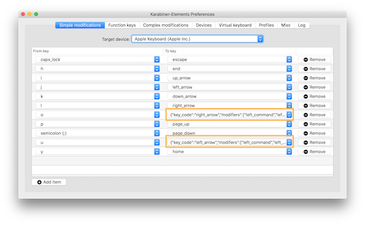
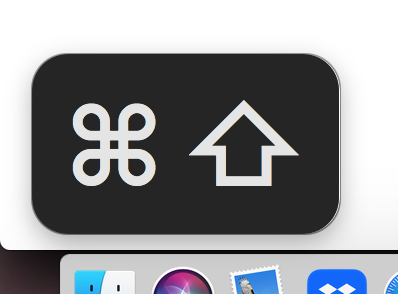

I've been on a quest to make typing more ergonomic and functional. I want to minimize chording (simultaneous keypresses) and mouse use to reduce pain in my hands, put keys I use more often in more advantageous places, automate repetitive activities, etc.

So, I was excited to discover [Karabiner-Elements](https://karabiner-elements.pqrs.org/) - free Mac software that allows you to do key remapping, control the mouse with the keyboard, run terminal commands, and much more.

The aims of this post are 1\) to share my research, joys, and struggles using [Karabiner-Elements](https://karabiner-elements.pqrs.org/) and 2\) to share [my karabiner config which has multi-profile support](https://github.com/scraggo/karabiner-ts-multi-profile) and utilizes [karabiner.ts](https://github.com/evan-liu/karabiner.ts).

## Installation, Configuring, and Debugging in Karabiner-Elements

- Carefully follow [the installation instructions](https://karabiner-elements.pqrs.org/docs/getting-started/installation/) to make sure permissions are enabled (otherwise the app won't work at all!)
- Open `Karabiner-Elements.app`
- `UI` tab: I opted to put both the [icon and profile name in the menu bar](https://karabiner-elements.pqrs.org/docs/manual/configuration/configure-menu-bar-icon/)
- `Devices` tab: Manipulate caps lock LED on for whichever devices I want to modify
- To do anything _slightly_ complicated, you'll need to edit the `~/.config/karabiner/karabiner.json` file
- `Log` tab: Very useful for debugging - you can see the output of your shell commands (discussed later)

Also for debugging, `Karabiner-EventViewer.app` shows exactly what keyboard and mouse events are being registered in real time. See [Confirm the result of configuration (EventViewer)](https://karabiner-elements.pqrs.org/docs/manual/operation/eventviewer/).

## Profiles

- To start, I opted to make a new profile and leave `Default` alone.
- You can configure a Complex Modification to select a profile with keypresses (more about this in later sections)

## Simple Modifications

You have the choice to modify all devices (choose "For all devices") or a single device. I only messed with single devices - external keyboards - mainly because I wanted to leave my laptop keyboard unmodified so I could re-type my password in case I accidentally left a profile on and locked the screen.

### to-from mapping and modifiers

- You can do basic "to" and "from" key mapping with just the UI.
- You can map "to" and "from" keys with modifiers (shift, control, etc) if you edit the `~/.config/karabiner/karabiner.json` file. (I don't think the docs mention this.) For example, here's a mapping of `"o"` to `"command + option + right_arrow"` (change to right tab):

```json
"simple_modifications": [
  {
    "from": {
      "key_code": "o"
    },
    "to": {
      "key_code": "right_arrow",
      "modifiers": [
        "left_command",
        "left_option"
      ]
    }
  },
  // ...etc
```

Within the Karabiner UI, you'll see the resulting JSON in the "To key" column:


An example that's frequently shown as a complex example works in simple modifications - mapping Caps Lock to the "Hyper" key (shift + control + command + option):

```json
{
  "from": {
    "key_code": "caps_lock",
    "modifiers": {
      "optional": ["any"]
    }
  },
  "to": [
    {
      "key_code": "left_shift",
      "modifiers": ["left_command", "left_control", "left_option"],
      "lazy": true
    }
  ]
}
```

A few notes:

- `from.modifiers` is an object and `to.modifiers` is an array. That discrepancy initially confused me. The docs on those fields describes them: [from.modifiers docs](https://karabiner-elements.pqrs.org/docs/json/complex-modifications-manipulator-definition/from/modifiers/) and [to.modifiers docs](https://karabiner-elements.pqrs.org/docs/json/complex-modifications-manipulator-definition/to/modifiers/)
- The [to.lazy](https://karabiner-elements.pqrs.org/docs/json/complex-modifications-manipulator-definition/to/lazy/) is helpful when you're using sticky keys which doesn't work right if "lazy" is `false`.

Once a "Hyper" key is set, you can create shortcuts that don't conflict with most common shortcuts.

### Sticky keys

I get pain in my hands when I do too much chording - simultaneous keypresses like "command + tab" and "command + option + left". [Karabiner (versions >= 13.3.0) provides "sticky" keys](https://karabiner-elements.pqrs.org/docs/help/how-to/sticky-modifier-key/) to address this. When you press the key once, a little display shows up and sticks around until you press the same key or another key. The result is you don't have to hold two keys down at the same time! Illustrative example:

- In Simple Modifications, set `left_shift` to be `sticky left_shift`
- Press left shift, let go, and you'll see a little notification that shift was pressed
- press 'a' and you'll get 'A'
- The little notification goes away


This was exciting to me - BUT - I then discovered that **sticky keys are built into Macs.** I enabled them on the OS level (through System Settings > Accessibility > Sticky Keys) and I've been using them that way ever since.



Pros of Mac Sticky keys:

- You get a few customization options in the system settings panel.
- You can press the modifier twice and it will stay on until you disable it which gives you a caps-lock-like functionality. I really like this. Because you can hit 'shift' twice,
  - caps lock is no longer needed, so you can set it to "hyper", `escape`, `delete_forward`, or anything you choose!
  - My idea to create a "shift" layer became redundant. I was going to make a profile dedicated to the Shifted version of the non-letter keys, like `<` `>` `!` `@` etc. Now I didn't have to.
- Older versions of Karabiner (if you use an old OS) don't have sticky keys.

Pros of Karabiner Sticky keys:

- You can set which keys you want to be sticky. Setting it at the OS level is all-or-nothing (which works fine for me).
- I didn't try this, but the behavior might be more consistent in use with modifiers set in Karabiner.

Cons of Sticky keys:

- You lose the ability to remap double-tapping or long-presses of modifiers

### Mouse Keys

A very interesting option to me is allowing the keyboard to act as a mouse. This functionality is built into the Mac with a feature called "Mouse Keys." See [Mouse Keys in macOS 12 Monterey | My Computer My Way](https://mcmw.abilitynet.org.uk/how-to-control-the-mouse-pointer-using-the-keyboard-in-macos-12-monterey) and [Mouse Keys | igeeksblog](https://www.igeeksblog.com/how-to-use-keyboard-as-mouse-on-mac/) and [Mouse Keys | osxdaily](https://osxdaily.com/2021/08/11/how-use-keyboard-as-mouse-mac/)

However, I find Mac's Mouse Keys to be lacking. The highest speed setting is too slow. There doesn't seem to be a way to speed it up without using another app. See [How can I speed up Mouse Keys? - Ask Different](https://apple.stackexchange.com/questions/54677/how-can-i-speed-up-mouse-keys)

Karabiner fills in the gaps. Not only can you fully emulate Mouse Keys at any speed you like, there are a few nice extras - like being able to hold a modifier and speed up or slow down the configured movements.

There were some confusing configuration bits:

- Moving in the `y` (up/down) direction is backwards to me - a _negative_ number goes up and a _positive_ number goes down. See below for setting "i" to go _up_ 600 pixels:

```json
{
  "from": {
    "key_code": "i"
  },
  "to": {
    "mouse_key": {
      "y": -600
    }
  }
}
```

- To move diagonally - up-left, up-right, down-left, and down-right - putting both `x` AND `y` distances in the field (which I didn't find documented) makes it happen:

```json
{
  "from": {
    "key_code": "u"
  },
  "to": {
    "mouse_key": {
      "x": -600,
      "y": -600
    }
  }
}
```

Use `vertical_wheel` and `horizontal_wheel` for scrolling. Both are backwards this time - _positive_ for left/down, _negative_ for right/up:

```json
{
  "from": {
    "key_code": "y"
  },
  "to": [
    {
      "mouse_key": {
        "vertical_wheel": 32
      }
    }
  ]
}
```

My mouse key mapping:

| From   | To          |
| ------ | ----------- |
| u      | ↖           |
| i      | ↑           |
| o      | ↗           |
| j      | ←           |
| l      | →           |
| m      | ↙           |
| ,      | ↓           |
| .      | ↘           |
| k      | left-click  |
| ctrl+k | right-click |
| ;      | scroll ↓    |
| p      | scroll ↑    |
| y      | scroll ←    |
| h      | scroll →    |
| shift  | speed 3.5   |
| option | speed .5    |

Note: A few Mac System preferences I messed with:

- Setting the "Primary mouse button" to button 2 _does affect_ Karabiner settings
- Setting "Scroll direction: Natural" _doesn't seem to affect_ Karabiner settings

## Function Keys

For Function Keys modifications to work how I wanted them to, I set up my Mac System Settings to the following:

`Keyboard > Use F1, F2, etc as standard function keys`

From there, I set my preferred shortcuts, since not all these are provided by Karabiner:

- Mission Control: F3
- Application Windows: F4
- Show Desktop: F5

In Karabiner, I leave `Use F1, F2, etc as standard function keys` unchecked. Now, anything unassigned in Mac System Settings can be configured by Karabiner.

In Function keys section, F1, F2, F6-F9 are mapped to themselves. Here's F1, for example:

```json
{
  "from": {
    "key_code": "f1"
  },
  "to": {
    "key_code": "f1"
  }
}
```

Mission control can be set in Karabiner:

```json
{
  "from": {
    "key_code": "f3"
  },
  "to": {
    "key_code": "mission_control"
  }
}
```

I really like F10 as mute, F11 as volume down, and F12 as volume up. Here's the Karabiner config in Function keys section:

```json
[
  {
    "from": {
      "key_code": "f10"
    },
    "to": {
      "consumer_key_code": "mute"
    }
  },
  {
    "from": {
      "key_code": "f11"
    },
    "to": {
      "consumer_key_code": "volume_decrement"
    }
  },
  {
    "from": {
      "key_code": "f12"
    },
    "to": {
      "consumer_key_code": "volume_increment"
    }
  }
]
```

## Complex Modifications

Now for the most powerful part - Complex Modifications. There are [examples in the docs](https://karabiner-elements.pqrs.org/docs/json/typical-complex-modifications-examples/) and [a ton more examples here.](https://ke-complex-modifications.pqrs.org/).

You can save rules you create in JSON files with whatever name you like in `~/.config/karabiner/assets/complex_modifications/`. They're then accessible when you choose "Add Rule." See [File locations | Karabiner-Elements](https://karabiner-elements.pqrs.org/docs/json/location/)

The area I was most excited to explore was [running shell commands](https://karabiner-elements.pqrs.org/docs/json/complex-modifications-manipulator-definition/to/shell-command/). I used [Karabiner's Command line interface](https://karabiner-elements.pqrs.org/docs/manual/misc/command-line-interface/) to switch between Karabiner profiles. I made a profile called "Nav" that enabled me to correspond a key to running the command to switch to that layer:

- Use a key dedicated to switching to "Nav". I chose F1.
- Once in "Nav", you can hit a key to choose another profile. F1 -> my main profile, F2 -> mouse, etc.
- Set all the non-layer profiles with F1 -> "Nav" layer.

Here's the JSON to select the "Nav" profile:

```json
{
  "description": "f1 -> select profile: Nav",
  "manipulators": [
    {
      "from": {
        "key_code": "f1"
      },
      "to": [
        {
          "shell_command": "'/Library/Application Support/org.pqrs/Karabiner-Elements/bin/karabiner_cli' --select-profile 'Nav'"
        }
      ],
      "type": "basic"
    }
  ]
}
```

In the earlier section on debugging, I mentioned the `Log` tab. That was really useful for determining why a bash script I wrote (not provided here) wasn't running correctly. Turns out, Karabiner was using an older version of bash than was on my machine. I found a workaround by setting it to run with zsh, but there are other options you can explore that I won't go into here.

## My Config and External Karabiner JSON generators

Manually editing the JSON config isn't the greatest user-experience. Thankfully, there are [external Karabiner JSON generators](https://karabiner-elements.pqrs.org/docs/json/external-json-generators/) that help with this problem.

- The first one I looked into was [Goku](https://github.com/yqrashawn/GokuRakuJoudo) and it didn't work for me. I got weird Java exceptions no matter how simple the code I put in. [It only allows complex modifications](https://github.com/yqrashawn/GokuRakuJoudo/issues/44). [Profiles aren't well supported](https://github.com/yqrashawn/GokuRakuJoudo/blob/master/examples.org#profiles) and I wanted multiple-profiles instead of "layers" and "sim-layers".
- I wound up [generating my config](https://github.com/scraggo/karabiner-ts-multi-profile) with [karabiner.ts](https://github.com/evan-liu/karabiner.ts). Given the nice developer experience and it's high-level of parity with Karabiner features, I recommend it highly! To fit my use cases, I added utilities to

  - create simple and function key modifications
  - add modifications to multiple profiles and optionally devices within

## Karabiner limitations and other things to look out for

The [features page](https://karabiner-elements.pqrs.org/docs/getting-started/features/) notes some limitations of Karabiner.

Operator priority: [complex_modifications manipulator evaluation priority | Karabiner-Elements](https://karabiner-elements.pqrs.org/docs/json/complex-modifications-manipulator-evaluation-priority/)

> Simple Modifications and Complex Modifications are independent.

Weird Behavior

- I found that after switching to certain profiles, keymaps wouldn't register right away. The most frustrating one was my mouse profile - pressing 'j' to move left, for example, would insert a 'j' character for at least a few keypresses.
- Sticky keys incompatibilities - noted earlier, it took me a while to figure out why my "hyper" key mods weren't working. Adding `"lazy": true` makes the key-mapping not-sticky, which is sort of a bummer.

Performance

- Switching profiles is sometimes slow - taking up to ~2 seconds.

## Conclusion

Thanks for reading and a big thank you to the creators of [Karabiner-Elements](https://karabiner-elements.pqrs.org/) and [karabiner.ts](https://github.com/evan-liu/karabiner.ts). I'm curious to hear if you try the utilities in [my karabiner config repo](https://github.com/scraggo/karabiner-ts-multi-profile).
