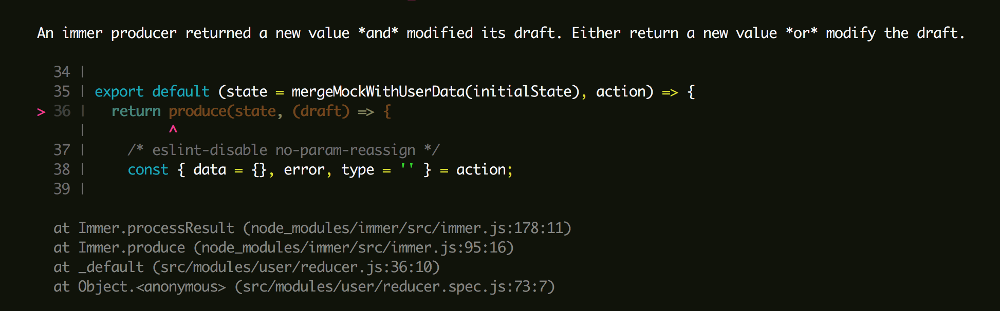

After having used [immutable js](https://immutable-js.github.io/immutable-js/docs/#/) for a while, discovering [ImmerJS](https://immerjs.github.io/immer/docs/introduction) was a breath of fresh air. Where immutable js forces you to learn its gigantic API, ImmerJS takes advantage of [ES6 Proxies](https://developer.mozilla.org/en-US/docs/Web/JavaScript/Reference/Global_Objects/Proxy). These allow you to modify a "draft" version of an object as if you're mutating it, but _the draft is actually a copy_ so you're not mutating the original! The return of immer's `produce` function always returns a perfect clone of the draft. ImmerJS also touts:

> Winner of the "Breakthrough of the year" React open source award and "Most impactful contribution" JavaScript open source award in 2019.
>
> Benefits
>
> - Immutability with normal JavaScript objects, arrays, Sets and Maps. No new APIs to learn!
> - Strongly typed, no string based paths selectors etc.
> - Structural sharing out of the box
> - Object freezing out of the box
> - Deep updates are a breeze
> - Boilerplate reduction. Less noise, more concise code.
> - First class support for patches
> - Small: 3KB gzipped

## Quick Example of Immer in Action

```js
// the main export of immer is the majority of what you need to know:
import produce from 'immer';

const baseState = [
  {
    todo: 'Learn typescript',
    done: true,
  },
  {
    todo: 'Try immer',
    done: false,
  },
];

// we use .push and direct assignment to modify the draftState.
// we don't even need to return the draftState. The return is implied!
const nextState = produce(baseState, draftState => {
  draftState.push({ todo: 'Tweet about it' });
  draftState[1].done = true;
});
```

I was _so_ excited when I first read about this library. I found an excuse to use it in a big collaborative side-project. It's a react app that makes heavy use of redux. As we know with both react and redux, one must treat state immutably. ImmerJS handles this exact problem and I don't need to convert the project to the mentality of `immutable js`, use [spread re-assignment](https://developer.mozilla.org/en-US/docs/Web/JavaScript/Reference/Operators/Spread_syntax), or [`lodash` cloneDeep](https://lodash.com/docs#cloneDeep).

## How Immer falls short

While ImmerJS touts being simple and intuitive to use, it has a significant learning curve. It has a [decent-sized list of pitfalls](https://immerjs.github.io/immer/docs/pitfalls) which makes me a bit suspicious about its usability in a big project.

Here are a few examples of the shortcomings I've ran into:

### Error: An immer producer returned a new value _and_ modified its draft. Either return a new value _or_ modify the draft

ImmerJS messes with my flow in Redux reducers. I have to be vigilant about where the draft is modified and where I want to return a new object. The error above provides a stack trace that doesn't point to the problem - it merely points to where the `produce` function containing the culprit is defined:



To fix this particular error, I had to move one of the `case` declarations to before where I modify the draft. Before:

```js
draft.error = null;

switch (type) {
  case LOGOUT:
    return initialState;
```

After:

```js
// immer doesn't let you return a new state after draft is modified.
if (type === LOGOUT) {
  return initialState;
}

draft.error = null;

switch (type) {
  case LOGIN:
    // etc...
```

We can see that after I modify the draft, it's _literally_ a point of no-return. We are forced to return the draft and not a new object. This is a buzz-kill, for sure.

### Spread assignment workaround

I've found ES6 spread re-assignment to be extremely cool:

```js
case LOGIN_SUCCESS:
  return {
    ...state,
    ...parsed, // this spreads all the properties received from `parsed` into new state
    firebaseData,
  };
```

However, as we saw above, we have to continue to modify state to stay in the ImmerJS mentality, so we need a workaround. At first, I came up with something that feels "old-school" (not in a good way):

```js
/**
 * Immer helper, akin to spread assignment:
 * @example Instead of { ...obj }, it will be spreadAssign(draft, obj)
 * @param {Object} draft
 * @param {Object} obj
 * @returns {Object} draft modified
 */
export const spreadAssign = (draft, obj) => {
  Object.entries(obj).forEach(([k, v]) => {
    // eslint-disable-next-line no-param-reassign
    draft[k] = v;
  });
  return draft;
};

// ...

// Reducer

case LOGIN_SUCCESS: {
  draft.firebaseData = firebaseData;
  spreadAssign(draft, parsed);
  return draft;
}
```

Writing helper functions for ImmerJS seems backwards to me. Then...I remembered good old [Object.assign()](https://developer.mozilla.org/en-US/docs/Web/JavaScript/Reference/Global_Objects/Object/assign) which modifies the object passed in as the first argument. I can now change the above to:

```js

// Reducer
case LOGIN_SUCCESS: {
  draft.firebaseData = firebaseData;
  Object.assign(draft, parsed);
  return draft;
}
```

Thankfully, I can delete my `spreadAssign` function which winds up being a subset of `Object.assign`.

## Conclusion

Be warned: finding workarounds (that aren't documented) and getting errors related to modifying drafts bring the learning curve of ImmerJS up. I'm not going to peel ImmerJS out of the codebase I'm working on just yet, but I expect to discover more headaches while continuing to use it. I love ImmerJS when it simplifies things, but hate it when it gets in the way.

_Have any thoughts on using immer? Please share them with me!_

[Contact me](/contact)
