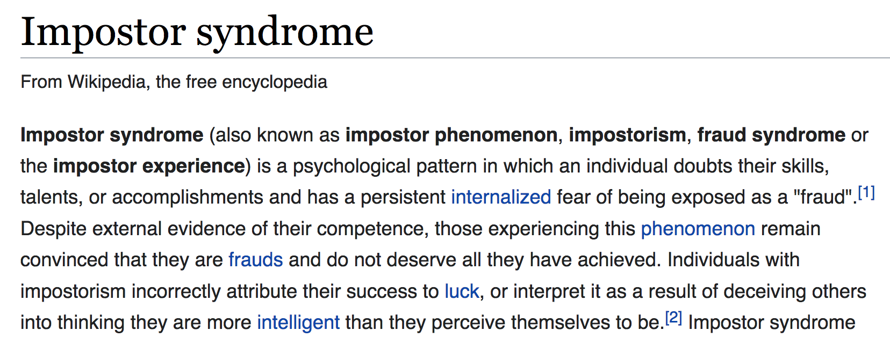

As professional programmers, the bulk of what we do is solving problems.

A lot of the time, I’m motivated by problem-solving challenges. But sometimes I hit a wall. A given challenge can become a problem that I’m frustratingly unable to solve.

Often, this frustration would spiral into a worse mental state. I'd imagine the problem as a scary, overwhelming, difficult to defeat monster - more difficult than it really is. I'd put _a lot_ of pressure on myself. "_Solving problems is my job_", after all.

You can probably see that this state of mind that isn’t conducive to problem solving.

I realized recently that this was happening pretty often. I'd get into a bad mood and be unpleasant to be around - generally having a negative impact on my life.

In order to stop this madness. I first needed to figure out why it was happening. After, I would create a new mental habit - which I'm calling "Programming with more ease."

Getting to the source of my mental hangups wasn't easy, but essentially, it boils down to:

- Encountering a problem led me to feel like it was somehow my fault that there was a problem in the first place. This indicated a habit of making "problematic things" personal and finding ways to feel guilty about them.
- This problem being "my fault" also meant to me that I should fix it right away. If I can’t do that, then it shows that I’m really not that intelligent and should probably not be in this industry. It’s [impostor syndrome](https://en.wikipedia.org/wiki/Impostor_syndrome) and a tendency to make myself inferior to things.

When discovering old, unchecked mental habits I now have a mantra to "rewrite the script." The old script is to feel guilty and stupid. The new script is to be detached and systematic - patiently working through the problem using the Socratic method and liberally taking breaks.

Here’s an example that peers into my old mental state.

A project I’m working on with a friend had an issue with the login form. To fix that immediate issue, I upgraded the 3rd party login provider package. After the upgrade, it revealed a bad way of handling a case where the user email doesn’t come back correctly from the service. I refactored the code a little bit and handled that better. Then I noticed the user account page was "messed up." There was now an even bigger bug than before. I felt that pang of guilt - I felt like I caused it. I started looking into it - the entire Redux user state was empty. My old script played:

> "I thought I was fixing this - and here we are. I can’t even use Redux properly."

My mood had tanked and I started the old, desperate "hack and slash" at the problem. Thankfully, my spouse interrupted me with the idea of stopping and taking a walk instead. While talking with her, it dawned on me that I wouldn’t expect anyone I was working with to _immediately_ "know" the answer to this problem - or any problem _immediately_ upon encountering it!

With my fresh realization, I tried a new mindset. I began with unapologetic detachment:

> "Seems like the state was relying on something that’s no longer happening."

I went on to describe it in disinterested detail:

> "When I log in, the user state doesn’t have the expected properties..."

Then I took a short break. The break allowed my subconscious to work on the problem - happily, this happens more often than not. After coming back, it was Rubber Duck Debug time. The rubber duck is my figurative programming student just learning the ropes. I asked questions in a Socratic manner - not expecting solutions, but probing for possible explanations. My goal was to create a list of the most promising leads and learn what there is to learn.

"What’s in the network call - is it empty?"

"What can I discover in the browser debugger?"

"Who is making the call to the login services?"

And so on.

In the end I got to the root cause - the app originally was fetching user data on initial mount, but it really needed to be fetching on an update.

It's not like I didn't know _how_ to debug, I was just putting a lot of stress on myself. That stress would cause "tunnel-vision" and I'd wind up not acting on knowledge I have.

To summarize my new process:

- Upon encountering a problem, describe it in a disinterested manner - no need for a lot of detail.
- Erase blame - it’s not my fault, it’s simply a fact of existence.
- Take a break. Think about something else and allow my subconscious to work on it.
- Be positive. Remind myself that I've had many past successes and I can do it. Discovering unwanted behavior is the first step to fixing it.
- Rubber duck debug. Describe the problem in detail, everything I know, and everything I'm assuming.
- Socratic method. Pretend I’m guiding a beginner programmer, asking them questions about assumptions, data flow, and anything else relevant to the problem. (This systematic process often leads to a lightbulb moment where a promising direction for troubleshooting pops into my head.)
- Take another break. Repeat anything above.

If I cant figure it out, I acknowledge that I’m a human and I either need outside help or to just put the problem away until I know more.

In conclusion: if you’re at all like me, you might be putting undue pressure on yourself. The process I outlined above has been working for me to alleviate some of this mental pressure. Can you relate? What helps you program with more ease?

## Resources

- **Recommended**: [Debugging Web Applications - benwilhelm.com](https://benwilhelm.com/)
- [8-Step Problem Solving Process | University Human Resources - The University of Iowa](https://hr.uiowa.edu/development/organizational-development/lean/8-step-problem-solving-process)
- [What is Problem Solving? Steps, Process & Techniques | ASQ](https://asq.org/quality-resources/problem-solving)
- [Rubber Duck Debugging – Debugging software with a rubber ducky](https://rubberduckdebugging.com/)
- [Socratic method - Wikipedia](https://en.wikipedia.org/wiki/Socratic_method)
- [How Do Work Breaks Help Your Brain? 5 Surprising Answers | Psychology Today](https://www.psychologytoday.com/us/blog/changepower/201704/how-do-work-breaks-help-your-brain-5-surprising-answers)
- [To Become a Better Writer, Be a Frequent Walker | Psychology Today](https://www.psychologytoday.com/us/blog/minding-the-body/201603/become-better-writer-be-frequent-walker)
