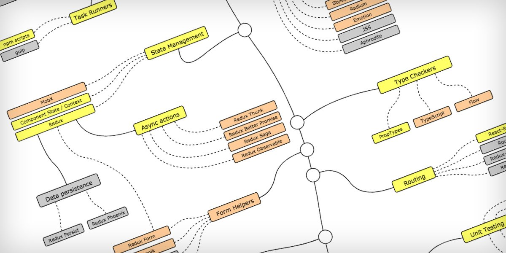

Did you just graduate from a coding bootcamp, obtain a CS degree, or built an involved side project? How do you know when you're ready to write software professionally?

This post is a collection of resources I've found or made that will help you on your job search. There are many questions to answer that are specific to your situation and what you're looking for. Are you trying to work front end, back end, or both? Would you prefer to be at a startup, an agency, or a larger company?

Once you know the answers to these and more questions, there are many roads to finding job opportunities that are a fit for you. It's ultimately up to you to decide your path and these resources can help clarify it.

## Career-related posts on this site

I've written a number of posts that go into some of my experiences starting my tech career and the decisions that went into it.

- [Tech Talk - How I'd Improve My Capstone Project](/tech-talk-improving-capstone-project/)
- [Contributing a New Feature to Open Source: @sindresorhus/is](/contributing-to-open-source-is-type-checking/)
- [How to ace your initial programming job screen](/prepare-for-initial-screens/)
- [Should junior developers work with recruiters?](/recruiters-and-junior-devs/)
- [Reflections From a Coding Bootcamp Graduate](/reflections-coding-bootcamp/)
- [Now Attending: Fullstack Academy](/now-attending-fullstack/)

Make sure to visit [Home](/) to stay up to date on new articles.

## A "curriculum" of sorts / links to external posts

> [Developer Roadmaps](https://roadmap.sh/)

### Behavioral questions

[13 Common Technical Interview Questions (With Tips and Example Answers) | Indeed.com](https://www.indeed.com/career-advice/interviewing/common-technical-interview-questions-and-answers)

[Most Common Technical Interview Questions](https://www.thebalancecareers.com/top-technical-interview-questions-2061227)

### Technical questions

- Code Review - If someone were reviewing your code, what would you like them to address? What are the most effective ways to deliver feedback?
- Pair Programming - Do you feel comfortable pairing with another developer? This could be whiteboarding and discussing ideas or coding out loud on a given problem.

### Past projects

- Did the project have a significant scope? Did it solve a unique need or were you following a tutorial?
- Did you write TESTS?

### Networking - what's effective?

- [66 New Ideas for Upping Your Networking Game](https://www.themuse.com/advice/66-new-ideas-for-upping-your-networking-game?utm_content=72015795&utm_medium=social&utm_source=linkedin) | [https://www.themuse.com/advice/66-new-ideas-for-upping-your-networking-game?utm_content=72015795&utm_medium=social&utm_source=linkedin](https://www.themuse.com/advice/66-new-ideas-for-upping-your-networking-game?utm_content=72015795&utm_medium=social&utm_source=linkedin)
- [stripe.com](https://stripe.com/atlas/guides/networking) | [https://stripe.com/atlas/guides/networking](https://stripe.com/atlas/guides/networking)

### Other Resources

- [https://medium.freecodecamp.org/how-to-make-progress-while-studying-for-coding-interviews-894c320bfa74](https://medium.freecodecamp.org/how-to-make-progress-while-studying-for-coding-interviews-894c320bfa74)
- [https://medium.freecodecamp.org/how-i-got-interviews-at-google-facebook-and-bridgewater-590c7c669592](https://medium.freecodecamp.org/how-i-got-interviews-at-google-facebook-and-bridgewater-590c7c669592)
- [https://github.com/TechBookHunter/Free-Coding-Interview-Books/tree/master/book](https://github.com/TechBookHunter/Free-Coding-Interview-Books/tree/master/book)
- [http://thatjsdude.com Interview Questions
  for front-end-Developer](http://thatjsdude.com/interview/index.html)
- [https://github.com/utatti/Front-end-Developer-Interview-Questions-And-Answers](https://github.com/utatti/Front-end-Developer-Interview-Questions-And-Answers)
- [Most comprehensive list of interview questions of companies scraped from geeksforgeeks, CareerCup and Glassdoor.](https://www.reddit.com/r/coolgithubprojects/comments/7yueg1/most_comprehensive_list_of_interview_questions_of/) | [https://www.reddit.com/r/coolgithubprojects/comments/7yueg1/most_comprehensive_list_of_interview_questions_of/](https://www.reddit.com/r/coolgithubprojects/comments/7yueg1/most_comprehensive_list_of_interview_questions_of/)
- [Top Tricky JavaScript Interview Questions](https://www.reddit.com/r/learnjavascript/comments/7xaeue/top_tricky_javascript_interview_questions/) | [https://www.reddit.com/r/learnjavascript/comments/7xaeue/top_tricky_javascript_interview_questions/](https://www.reddit.com/r/learnjavascript/comments/7xaeue/top_tricky_javascript_interview_questions/)
- [How I applied lessons learned from a failed technical interview to get 5 job offers](https://medium.freecodecamp.org/how-i-applied-lessons-learned-from-a-failed-technical-interview-to-get-5-job-offers-656fcf58034d) | [https://medium.freecodecamp.org/how-i-applied-lessons-learned-from-a-failed-technical-interview-to-get-5-job-offers-656fcf58034d](https://medium.freecodecamp.org/how-i-applied-lessons-learned-from-a-failed-technical-interview-to-get-5-job-offers-656fcf58034d)
- [10 Interview Questions Every JavaScript Developer Should Know](https://medium.com/javascript-scene/10-interview-questions-every-javascript-developer-should-know-6fa6bdf5ad95) | [https://medium.com/javascript-scene/10-interview-questions-every-javascript-developer-should-know-6fa6bdf5ad95](https://medium.com/javascript-scene/10-interview-questions-every-javascript-developer-should-know-6fa6bdf5ad95)
- [10 Questions to Ask in an Interview for Developers](https://www.lifehack.org/articles/technology/10-questions-to-ask-in-an-interview-for-developers.html) | [https://www.lifehack.org/articles/technology/10-questions-to-ask-in-an-interview-for-developers.html](https://www.lifehack.org/articles/technology/10-questions-to-ask-in-an-interview-for-developers.html)
- [How To Prepare For The Unknown On Your Next Coding Interview](https://blog.pramp.com/https-medium-com-pramp-how-to-prepare-for-the-unknown-on-your-next-coding-interview-5705835ef1ce) | [https://blog.pramp.com/https-medium-com-pramp-how-to-prepare-for-the-unknown-on-your-next-coding-interview-5705835ef1ce](https://blog.pramp.com/https-medium-com-pramp-how-to-prepare-for-the-unknown-on-your-next-coding-interview-5705835ef1ce)
- [(16) How to: Work at Google — Example Coding/Engineering Interview - YouTube](https://www.youtube.com/watch?v=XKu_SEDAykw) | [https://www.youtube.com/watch?v=XKu_SEDAykw](https://www.youtube.com/watch?v=XKu_SEDAykw)
- [Technical interview with a Google engineer: Edit distance string comparison - YouTube](https://www.youtube.com/watch?v=wyu6VRmtCmE)
- [GitHub - donnemartin/system-design-primer: Learn how to design large-scale systems. Prep for the system design interview. Includes Anki flashcards.](https://github.com/donnemartin/system-design-primer)
- [Top 50 React Interview Questions and Answers For 2019 | Edureka](https://www.edureka.co/blog/interview-questions/react-interview-questions/)
- [REACTO: Technical Interview Prep the Fullstack Way](https://medium.com/@sarahscode/reacto-technical-interview-prep-the-fullstack-way-706929a44e90) | [https://medium.com/@sarahscode/reacto-technical-interview-prep-the-fullstack-way-706929a44e90](https://medium.com/@sarahscode/reacto-technical-interview-prep-the-fullstack-way-706929a44e90)
- [5 things you need to know in a programming interview](https://medium.freecodecamp.org/the-most-important-things-you-need-to-know-for-a-programming-interview-3429ac2454b)
- [How I got 7 Job Offers in 8 Weeks (Part 1: Please Interview Me?)](https://blog.usejournal.com/how-i-got-7-job-offers-in-8-weeks-part-1-please-interview-me-21e6f4ded106) | [https://blog.usejournal.com/how-i-got-7-job-offers-in-8-weeks-part-1-please-interview-me-21e6f4ded106](https://blog.usejournal.com/how-i-got-7-job-offers-in-8-weeks-part-1-please-interview-me-21e6f4ded106)
- [Google Can Predict Whether You'll Get Hired After 4 Interviews. Here's How | Inc.com](https://www.inc.com/michael-schneider/5-years-of-google-data-reveals-number-of-interviews-it-takes-to-find-perfect-candidate.html) | [https://www.inc.com/michael-schneider/5-years-of-google-data-reveals-number-of-interviews-it-takes-to-find-perfect-candidate.html](https://www.inc.com/michael-schneider/5-years-of-google-data-reveals-number-of-interviews-it-takes-to-find-perfect-candidate.html)
- [30-seconds-of-interviews/README.md at master · fejes713/30-seconds-of-interviews](https://github.com/fejes713/30-seconds-of-interviews/blob/master/README.md) | [https://github.com/fejes713/30-seconds-of-interviews/blob/master/README.md](https://github.com/fejes713/30-seconds-of-interviews/blob/master/README.md)
- [7 CSS Interview Questions and Answers | Indeed.com](https://www.indeed.com/hire/interview-questions/css) | [https://www.indeed.com/hire/interview-questions/css](https://www.indeed.com/hire/interview-questions/css)
- [Top 10 System Design Interview Questions for Software Engineers](https://hackernoon.com/top-10-system-design-interview-questions-for-software-engineers-8561290f0444) | [https://hackernoon.com/top-10-system-design-interview-questions-for-software-engineers-8561290f0444](https://hackernoon.com/top-10-system-design-interview-questions-for-software-engineers-8561290f0444)
- [37 Essential JavaScript Interview Questions and Answers](https://www.toptal.com/javascript/interview-questions) | [https://www.toptal.com/javascript/interview-questions](https://www.toptal.com/javascript/interview-questions)
